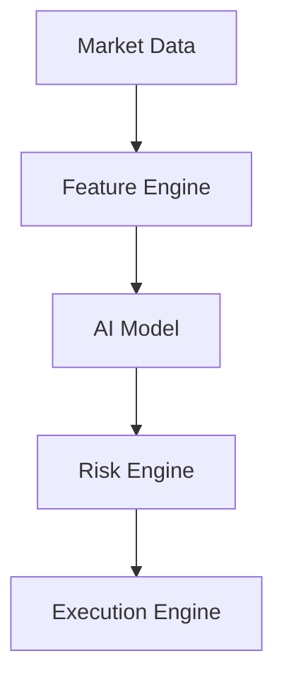

# Architecture

## Pipeline (logical flow)



## Responsibilities

| Module | Input | Output | Notes |
|--------|--------|--------|--------|
| **Market Data** | Exchange / files | Canonical bars, trades | Single timebase (UTC), consistent symbols; **CSV** / **Parquet** / **SQLite** (`load_bars_csv`, `load_bars_parquet`, `load_bars_sqlite`, `append_bars_sqlite`) |
| **Feature Engine** | Bar stream | Feature vector per step | Versioned schema; no peeking at future bars |
| **AI Model** | Features | Signals: trend, vol, momentum | Probabilities or scores + confidence |
| **Risk Engine** | Signals + account state | Sized intent: side, qty, stops, flags | Daily loss cap; optional **spot free balance** clip (`SpotBalanceFree`) |
| **Execution Engine** | Risk-approved intent | Orders, fills, errors | Idempotent client order IDs; `create_execution_engine` (`paper` / `ccxt-dry` / guarded **`ccxt-live`**) for daemons |

## Package layout (target)

```
src/crypto_bot/
  __init__.py
  config.py
  backtest/       # Walk-forward replay (bars → orchestrator)
  pipeline/       # Phase 6 slice: orchestrator (signal → risk → execution)
  loop/           # Daemons: stub + CCXT poll → features → orchestrator
  market_data/     # Phase 1 (ccxt_provider, ccxt_balance, bars_csv, bars_parquet, bars_sqlite, normalize, …)
  features/        # Phase 2 (config, engine, schema)
  model/           # Phase 3 (labels, dataset, baseline, metrics, artifacts, registry JSON)
  risk/            # Phase 4 (limits, kill-switch, sizing)
  execution/       # Phase 5 (paper, ccxt_sync, factory, order types, …)
```

## Design rules

1. **Dependency direction:** `execution` may depend on `risk`; `risk` must not import `execution`.  
2. **Pure vs IO:** features + risk sizing math stay pure where possible; IO only in market + execution.  
3. **Config:** thresholds (max daily loss, max position) live in config/env, not scattered constants.  
4. **Observability:** every stage logs structured context (symbol, bar time, decision id).  
5. **Secrets:** API keys and exchange secrets only via environment (e.g. `CRYPTO_BOT_*`); never commit `.env` or log secrets.

## Non-goals (initially)

- Ultra-low-latency HFT co-location  
- Multi-exchange smart order routing  
- Full portfolio optimization across dozens of names  

These can be layered later without rewriting the core pipeline.

## Backtest (walk-forward)

**`backtest/walk_forward`** replays a bar list in time order: for each index ``i``, features use ``bars[:i+1]`` only (no lookahead), then **`Orchestrator`** → paper fills. Risk **`mark_equity`** is either fixed (**`initial_equity`**) or **mark-to-market** (**cash + position × close** after each step’s new fills). CLI: **`crypto-backtest`** (`--bars-csv`, **`--bars-parquet`**, **`--bars-sqlite`**, demo bars, **`--mark-to-market`**).
