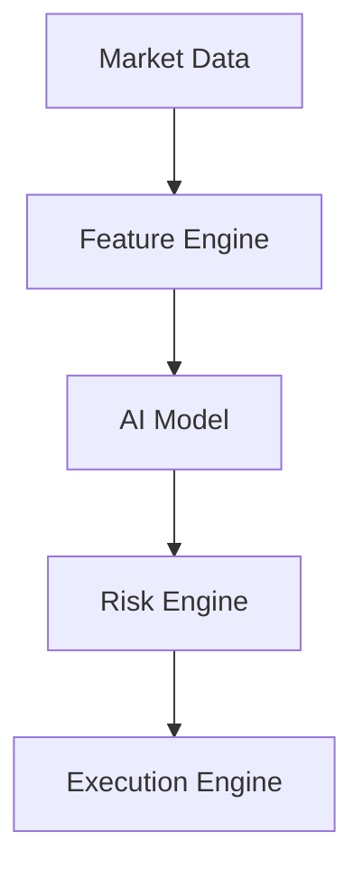

# Architecture

## Pipeline (logical flow)



## Responsibilities

| Module | Input | Output | Notes |
|--------|--------|--------|--------|
| **Market Data** | Exchange / files | Canonical bars, trades | Single timebase (UTC), consistent symbols |
| **Feature Engine** | Bar stream | Feature vector per step | Versioned schema; no peeking at future bars |
| **AI Model** | Features | Signals: trend, vol, momentum | Probabilities or scores + confidence |
| **Risk Engine** | Signals + account state | Sized intent: side, qty, stops, flags | Hard daily loss cap; blocks if breached |
| **Execution Engine** | Risk-approved intent | Orders, fills, errors | Idempotent client order IDs |

## Package layout (target)

```
src/crypto_bot/
  __init__.py
  config.py
  cli/             # user-facing commands (fetch_bars, …)
  market_data/     # Phase 1 (ccxt_provider, normalize, …)
  features/        # Phase 2
  model/           # Phase 3
  risk/            # Phase 4
  execution/       # Phase 5
```

## Design rules

1. **Dependency direction:** `execution` may depend on `risk`; `risk` must not import `execution`.  
2. **Pure vs IO:** features + risk sizing math stay pure where possible; IO only in market + execution.  
3. **Config:** thresholds (max daily loss, max position) live in config/env, not scattered constants.  
4. **Observability:** every stage logs structured context (symbol, bar time, decision id).

## Non-goals (initially)

- Ultra-low-latency HFT co-location  
- Multi-exchange smart order routing  
- Full portfolio optimization across dozens of names  

These can be layered later without rewriting the core pipeline.
